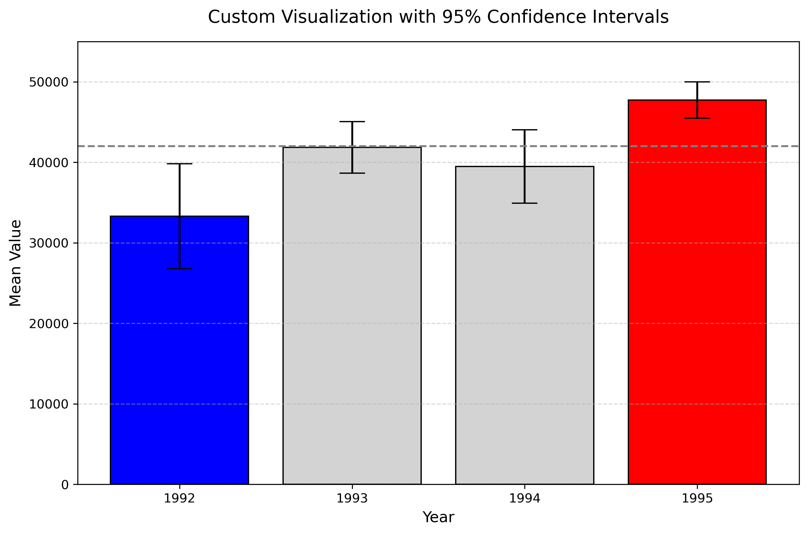

# University of Michigan Python Specialization

This repository contains my assignments, labs, and projects completed as part of the **University of Michigan Python Specialization** on Coursera.

## 📌 Overview
The purpose of this repository is to document my learning progress and showcase practical applications of Python in data analysis, visualization, and problem solving.

---

## 📊 Featured Project

### Assignment 3 — Custom Visualization with Confidence Intervals

This project demonstrates how to build a custom data visualization using **matplotlib** and statistical concepts.

### 🔍 Key Features
- Calculation of mean values for each dataset (1992–1995)
- Computation of **95% confidence intervals**
- Visualization using bar charts with error bars
- Dynamic color-coding based on a reference value (42,000):
  - 🔵 Blue → values clearly below the threshold  
  - 🔴 Red → values clearly above the threshold  
  - ⚪ Gray → values overlapping the threshold  

### 📈 Visualization Output

---

## 🧰 Tools & Technologies
- Python
- Jupyter Notebook
- Pandas
- NumPy
- Matplotlib
- SciPy

---

## 🚀 Learning Objectives
- Understand statistical uncertainty in data
- Apply confidence intervals in visualizations
- Improve data storytelling with visual techniques
- Build professional-quality plots using Python

---

## 📁 Repository Structure
